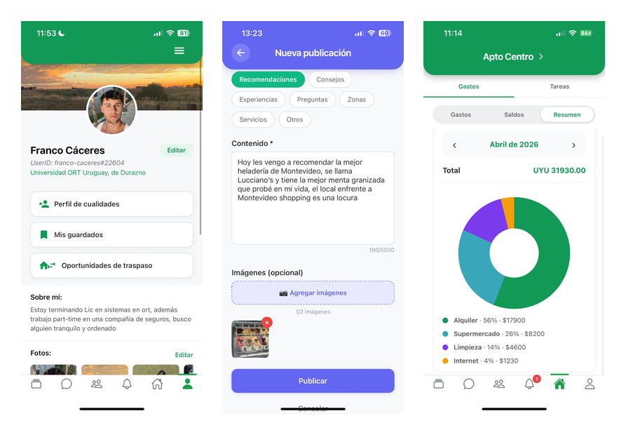
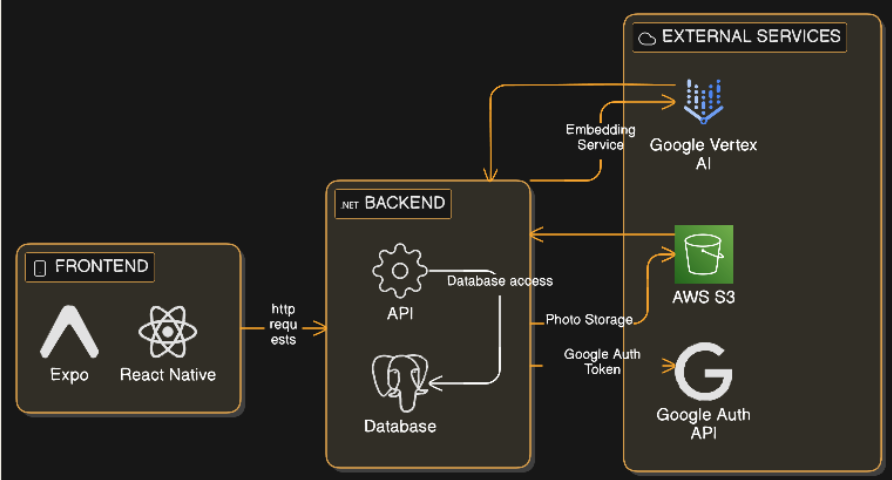
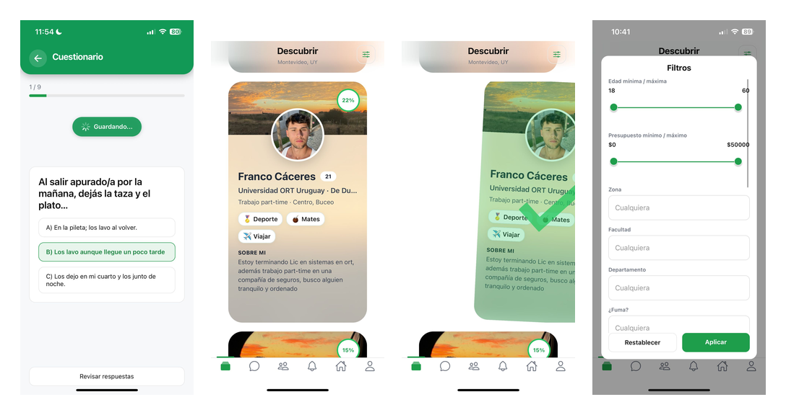
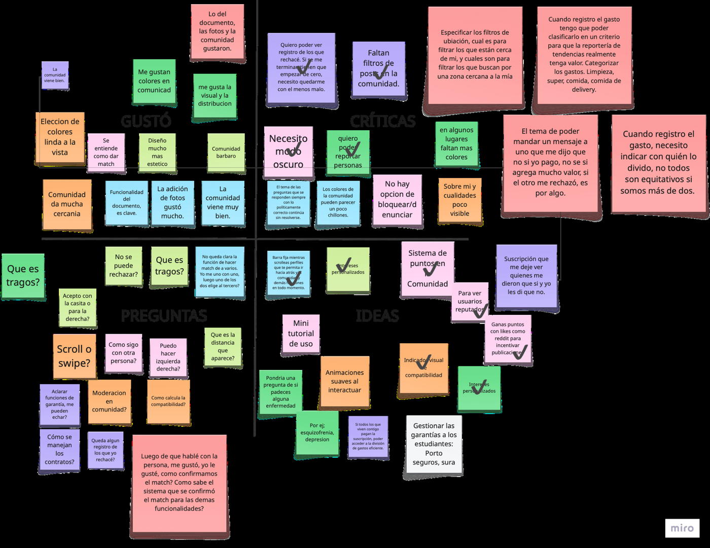
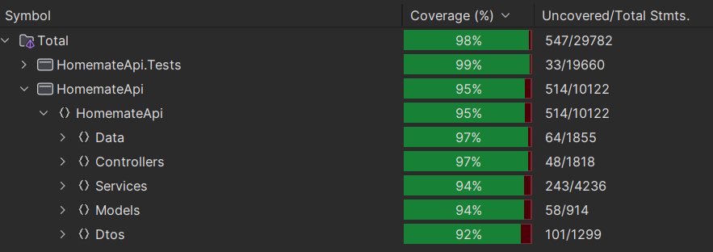

<p align="center">
  
</p>

<h1 align="center">HomeMate</h1>

<p align="center">
  <strong>Roommate matching and shared-living management for students moving to Montevideo.</strong>
</p>

<p align="center">
  Final Degree Project · Bachelor's Degree in Information Systems · Universidad ORT Uruguay · 2026
</p>

---

## Overview

**HomeMate** is a mobile platform designed to improve the experience of finding a roommate and managing shared living.

The project focuses primarily on students from other regions of Uruguay who move to Montevideo to study — a transition that often involves finding housing, adapting to a new city and deciding who to live with, frequently without an established network of contacts.

Existing alternatives tend to focus on property availability, price or informal connections. HomeMate approaches the problem from a different perspective:

> **Finding someone to live with is not enough. The real challenge is finding someone you can live well with.**

The platform combines a **hybrid compatibility engine**, identity verification, direct communication, community features and household-management tools into a single mobile experience.

<p align="center">
  
</p>

---

## The Problem

The project began with a user-centered discovery process aimed at understanding how young people experience shared housing.

Research identified several recurring challenges:

* roommate searches are highly fragmented and often informal;
* users have limited information to evaluate compatibility before living together;
* differences in cleanliness, routines, noise, visitors and lifestyle can strongly affect coexistence;
* trust is a major barrier when interacting with strangers;
* finding a roommate is only the first step — organizing expenses, tasks and agreements also affects the quality of shared living.

HomeMate was designed to address both stages of the problem:

**finding compatible people** and **supporting the experience after they begin living together**.

---

## Key Features

### Smart Roommate Matching

Users receive a normalized compatibility percentage based on multiple independent signals rather than a single questionnaire or basic profile filters.

### Profiles & Coexistence Questionnaire

Profiles combine personal information, interests, housing preferences, free-text biography and structured questions about everyday coexistence.

### Discover & Swipe

Users can browse potential roommates, apply filters and accept or reject suggested profiles through a mobile-first discovery experience.

### Identity Verification

A verification flow was incorporated to increase trust and reduce uncertainty when users interact with people they do not already know.

### Private Messaging

Users who match can communicate through private one-to-one conversations before making any housing decision.

### Community

A dedicated community space allows users to create posts, comment, exchange recommendations and interact around topics related to moving, housing and student life.

### Shared-Living Management

Once users share a home, the platform provides tools to organize:

* shared expenses;
* balances;
* household tasks;
* household responsibilities.

### Rental Transfers

Users can publish rental-transfer opportunities, browse available listings and contact the person offering the transfer.

---

## Engineering Highlights

* Hybrid roommate recommendation system combining **structured, semantic and behavioral signals**
* Semantic search using **Vertex AI embeddings + PostgreSQL/pgvector**
* **Modular monolith** with clear presentation, business and persistence layers
* Cross-platform mobile application built with **React Native + Expo + TypeScript**
* REST API built with **ASP.NET Core / .NET**
* Private object storage using **Amazon S3 + IAM + presigned URLs**
* Cloud deployment using **DigitalOcean App Platform**
* Automated quality gates with **GitHub Actions**
* **≥ 90% backend coverage requirement** enforced before integration
* Risk-based testing strategy and **k6 load testing**
* Iterative product validation with real users throughout discovery and development

---

## Tech Stack

| Area                   | Technologies                                   |
| ---------------------- | ---------------------------------------------- |
| **Mobile**             | React Native, Expo, TypeScript                 |
| **Navigation & State** | React Navigation, TanStack Query, AsyncStorage |
| **HTTP Client**        | Axios                                          |
| **Backend**            | C#, .NET, ASP.NET Core Web API                 |
| **Persistence**        | Entity Framework Core                          |
| **Database**           | PostgreSQL                                     |
| **Vector Search**      | pgvector                                       |
| **AI / Embeddings**    | Google Vertex AI                               |
| **Authentication**     | JWT, Google OAuth                              |
| **Object Storage**     | Amazon S3                                      |
| **Infrastructure**     | Docker, DigitalOcean App Platform              |
| **Mobile Builds**      | Expo EAS Build                                 |
| **Beta Distribution**  | TestFlight, Android APK                        |
| **Testing**            | MSTest, k6                                     |
| **CI/CD**              | GitHub Actions                                 |

---

## Architecture

The backend was designed as a **modular monolith**.

Although deployed as a single application, its internal structure separates responsibilities into clearly defined layers and modules, keeping business logic independent from presentation and infrastructure concerns.

<p align="center">
  
</p>

### Presentation Layer

The mobile client is built with **React Native, Expo and TypeScript**.

Its main responsibility is user interaction and presentation. Communication with the backend is performed through HTTP using Axios, while TanStack Query manages remote state, caching and mutations.

Critical business rules remain on the server rather than being duplicated in the client.

### Business Layer

The backend is implemented as an **ASP.NET Core Web API**.

It centralizes:

* business rules;
* authentication and authorization;
* profile management;
* matching logic;
* community functionality;
* messaging;
* household management;
* integrations with external services.

### Persistence Layer

Persistence combines:

* **PostgreSQL** for relational application data;
* **pgvector** for vector storage and similarity search;
* **Entity Framework Core** for relational mapping and data access;
* **Amazon S3** for multimedia and document storage.

### Design Patterns

Several patterns were applied to keep responsibilities separated and integrations replaceable:

* **Controller-Service-Repository**
* **Dependency Injection**
* **Adapter** for the embedding provider
* **Singleton** for reusable external-service clients

The embedding provider is abstracted behind an internal contract, allowing the matching engine to remain independent from the specific AI provider used to generate embeddings.

---

## Matching Engine

The matching system is one of the core technical components of HomeMate.

Instead of treating compatibility as a single similarity metric, the engine uses a **multi-stage hybrid pipeline** combining hard constraints, semantic similarity and structured behavioral information.

<p align="center">
  
</p>

### 1. Structural Filtering

Before calculating similarity, the backend removes candidates that do not satisfy the user's objective requirements.

Filters can include dimensions such as:

* age range;
* gender;
* geographic preferences;
* faculty;
* department of origin;
* budget;
* blocked users;
* other search preferences.

This reduces the candidate space before more expensive ranking operations are executed.

### Dealbreakers

Non-negotiable coexistence conditions are also handled at this stage.

A dealbreaker is treated as a **hard constraint**, not as another weighted similarity signal.

For example, if one user considers smoking inside the home unacceptable, a candidate who requires that behavior should not receive a high compatibility percentage simply because every other dimension matches.

Only viable candidates continue into the ranking process.

---

### 2. Semantic Candidate Selection

HomeMate generates embeddings from two different sources:

**Questionnaire embeddings** capture semantic information related to behaviors and coexistence preferences.

**Biography embeddings** capture information expressed freely by the user about personality and lifestyle.

Embeddings are generated through **Vertex AI** and stored in PostgreSQL using **pgvector**.

Cosine similarity is used to compare vectors and identify semantically close profiles.

Using pgvector allows HomeMate to combine traditional relational persistence and vector search in the same database instead of introducing a separate vector database.

---

### 3. Behavioral Traits

Questionnaire answers are also transformed into quantifiable behavioral dimensions called **traits**.

Examples include:

* cleanliness;
* noise tolerance;
* visitor policy;
* other coexistence-related behaviors.

For a shared trait, compatibility is calculated from the normalized distance between both users:

```text
traitScore = 1 - (|a - b| / maxDiff)
```

This produces a continuous score between `0` and `1`.

The approach avoids reducing compatibility to a binary "same / different" decision and preserves interpretability for individual behavioral dimensions.

---

### 4. Interest Similarity

Interests are normalized before comparison and evaluated using **Jaccard similarity**:

```text
J(A, B) = |A ∩ B| / |A ∪ B|
```

Jaccard was selected because interests behave naturally as unordered sets and the metric provides an interpretable measure of relative overlap.

---

### 5. Multi-Channel Re-Ranking

The final ranking combines four main channels:

1. questionnaire semantic similarity;
2. biography semantic similarity;
3. interest similarity;
4. behavioral trait similarity.

Each channel has a configurable weight.

```text
Structural Filters
       │
       ▼
  Dealbreakers
       │
       ▼
Candidate Preselection
       │
       ▼
 ┌─────────────────────────┐
 │ Questionnaire Embedding │
 │ Biography Embedding     │
 │ Interests               │
 │ Behavioral Traits       │
 └─────────────────────────┘
       │
       ▼
Weighted Re-Ranking
       │
       ▼
Compatibility Percentage
      0 - 100%
```

If a particular compatibility channel is unavailable for a user, the engine can omit that channel instead of failing the entire pipeline.

The weights were informed by the product-discovery research and iteratively adjusted while evaluating whether generated rankings were coherent with expected compatibility between test profiles.

---

## Messaging Design

For private messaging, several alternatives were evaluated, including WebSockets, Server-Sent Events and external realtime platforms.

The selected solution uses **adaptive periodic synchronization through HTTP**.

For the scope of the MVP, messaging did not require strict real-time guarantees. The selected approach provided the necessary interaction while avoiding persistent connections, additional infrastructure and unnecessary operational complexity.

This reflects a broader engineering principle followed throughout the project:

> Choose the simplest architecture that adequately satisfies the real requirement.

---

## File Storage & Security

User-generated media and verification documents are stored separately from the relational database using **Amazon S3**.

Objects remain private and are accessed through **temporary presigned URLs generated by the backend**.

The storage integration follows the principle of least privilege through dedicated IAM permissions.

Additional security practices include:

* JWT-based authentication;
* hashed password storage;
* HTTPS/TLS communication;
* credentials managed outside the source code through environment configuration;
* server-side authorization and business rules.

---

## Product Discovery

HomeMate was not built from a predefined list of features.

The project began with an extensive **Product Discovery** process based on Design Thinking.

Research included:

* **110 survey participants**
* **14 in-depth interviews**
* secondary research
* analysis of existing platforms
* user profiles and personas
* problem-pattern analysis
* ideation and prioritization
* multiple prototype iterations

Competitor analysis included platforms such as Badi and Roomster.

While existing products provided useful mechanisms for discovering rooms or roommates, the research identified an opportunity to create a solution more closely adapted to the Uruguayan context and to extend the experience beyond the initial connection between users.

---

## User Validation

Validation was performed iteratively rather than only after implementation.

Early prototypes were tested through **Think Aloud sessions**, where participants interacted with the product while explaining their thoughts, doubts and expectations.

Feedback was categorized and weighted according to the participant's relevance to the target segment, then incorporated into subsequent iterations.

<p align="center">
  
</p>

Validation continued during development as functional increments became available.

The final beta application was distributed to real users through **TestFlight** on iOS and direct APK distribution on Android.

A final satisfaction and usability survey collected **21 responses**, with average results meeting the project's target of **at least 4 out of 5** for usability and satisfaction criteria.

---

## Quality Engineering

Software quality was addressed throughout the development lifecycle using **ISO/IEC 25010** as a reference for relevant quality attributes.

The testing strategy followed a **risk-based approach**: components with greater probability of failure or greater potential impact received more extensive verification.

Critical areas included:

* authentication;
* user management;
* user relationships;
* the compatibility engine.

Testing included:

* unit tests;
* functional tests;
* integration tests;
* exploratory testing;
* usability testing;
* load testing.

### Unit Testing & Coverage

Backend unit tests were implemented with **MSTest**.

A minimum line-coverage threshold of **90%** was enforced by the CI pipeline. If coverage dropped below the threshold or a test failed, integration was blocked.

The final coverage report shown below reached **95% for the main API project** and **98% across the displayed solution**.

<p align="center">
  
</p>

---

## Continuous Integration

GitHub Actions automatically executed validation when changes were proposed for integration.

The pipeline included:

```text
Pull Request
     │
     ▼
Restore Dependencies
     │
     ▼
Build
     │
     ▼
Run Unit Tests
     │
     ▼
Generate Coverage
     │
     ▼
Validate ≥ 90%
     │
     ▼
Allow / Block Integration
```

This converted testing and coverage requirements from informal conventions into automated quality gates.

---

## Load Testing

Performance was evaluated using **k6**.

### Local environment

The authentication flow was tested with:

* **100 simultaneous virtual users**
* **600 login requests**
* **0% failed requests**
* median latency of approximately **195 ms**
* p95 latency of approximately **4.92 s**

### Cloud environment

A progressive-load scenario was also executed against the deployed environment:

* up to **20 concurrent virtual users**
* **522 login requests**
* **0% failed requests**
* median latency of approximately **598 ms**
* p95 latency of approximately **1.42 s**

Both scenarios remained within the performance thresholds defined for their respective tests.

---

## Deployment & Distribution

The backend and database were deployed remotely to enable validation outside local development environments.

### Backend

**DigitalOcean App Platform** was selected after evaluating different infrastructure approaches.

The decision prioritized:

* compatibility with .NET and PostgreSQL;
* operational simplicity;
* deployment speed;
* cost;
* suitability for the project's maturity level.

### Mobile

Native application builds were generated through **Expo EAS Build** for both iOS and Android.

The beta was distributed through:

* **TestFlight** for iOS;
* installable **APK builds** for Android.

This allowed the MVP to be validated on real devices by users outside the development team.

---

## Key Results

| Metric                            |               Result |
| --------------------------------- | -------------------: |
| Exploratory survey                | **110 participants** |
| In-depth interviews               |  **14 participants** |
| Final beta survey                 |     **21 responses** |
| Usability target                  | **≥ 4 / 5 achieved** |
| Required backend coverage         |            **≥ 90%** |
| Main API coverage in final report |              **95%** |
| Local load-test failures          |               **0%** |
| Cloud load-test failures          |               **0%** |
| Cloud authentication p95          |          **~1.42 s** |

---

## Project Status

HomeMate reached a **functional MVP** covering the core product experience:

* profile creation;
* coexistence questionnaire;
* hybrid roommate matching;
* identity verification;
* private messaging;
* community;
* household expenses and tasks;
* rental-transfer opportunities.

The application was deployed to a remote environment and distributed to beta users on real mobile devices for validation.

Future evolution includes further matching calibration and explainability, onboarding improvements, broader user acquisition and eventual public distribution through the App Store and Google Play.

---

## Team

HomeMate was developed by:

* **Tiago Abenante**
* **Franco Cáceres**
* **Lucas Medina**
* **Martina Roll**

as the final degree project for the **Bachelor's Degree in Information Systems at Universidad ORT Uruguay**.

---

## Source Code

The application source code is maintained in a **private team repository**.

This public repository serves as a technical case study of the product and documents its:

* product discovery;
* architecture;
* matching strategy;
* engineering decisions;
* quality practices;
* validation process;
* infrastructure and deployment.

Private source code, secrets and credentials are not included in this repository.
